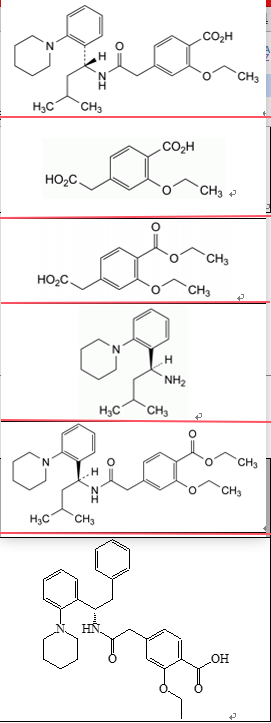
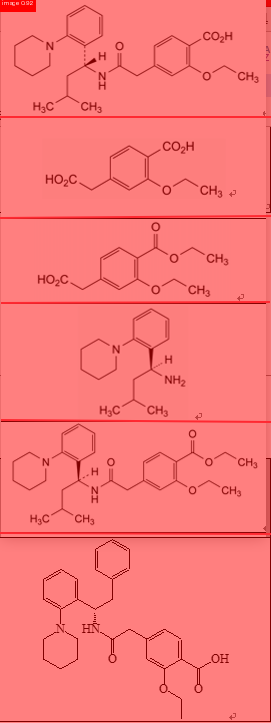
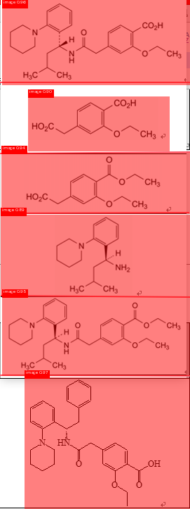

# PP-DocLayoutV3 微调实战

```
1. 下面所有涉及Windows的命令，都在Powershell/Windows Terminal里运行
2. 使用uv作为Python的包管理，需要提前安装
```


## 1. Why This Project exists
PP-DocLayoutV3 是 PaddleOCR-VL-1.5的重要组成组件<br/>
整个工作流大致为:<br/>
版面分析(PP-DocLayoutV3) → 文字OCR(PaddleOCR-VL-1.5)

遇到版面分析失败，会影响后续识别准确率，如以下例子<br/>
原始输入(多个结构式在一张图片里面)<br/>


原始输出(几个结构式图片没有切分开)<br/>


训练结果(几个结构式图片已经切分开)<br/>



## 2. 安装依赖
```shell
# 安装基础依赖
uv sync

# windows only
winget install BYVoid.OpenCC --source winget

# 安装最新的paddlepaddle-gpu，我这里cuda13，命令如下
uv pip install paddlepaddle-gpu==3.3.1 -i https://www.paddlepaddle.org.cn/packages/stable/cu130/

# paddlex安装模型模型插件 PP-DocLayoutV3
# 安装过程中可能会提示没有repos文件夹，手动新增即可
mkdir '.\.venv\Lib\site-packages\paddlex\repo_manager\repos'
uv run paddlex --install PaddleDetection

# 安装其他模型插件，本次不是必须
uv run paddlex --install PaddleOCR

# 可能还会提示缺少配置文件
cp ./.venv/lib/python/site-packages/paddlex/repo_manager/repos/PaddleDetection/configs/layout_analysis/PP-DocLayoutV3.yaml  where/it/need/PP-DocLayoutV3.yaml
```


## 3. 数据集准备
这部分我主要让ClaudeCode自己写，让它记得`PP-DocLayoutV3`一共有哪25个分类，id是什么即可
输出到`./data/`文件夹下面


## 4. 训练

### 4.1 准备训练所需配置文件
参考 `./configs/PP-DocLayoutV3.yaml`
<br/>配置参考: `paddlex/configs/modules/layout_analysis/PP-DocLayoutV3.yaml`
<br/>主要配置:
```yaml
Global:
  dataset_dir: "data/dense_chem"
...
Train:
  num_classes: 25
  epochs_iters: 2
  batch_size: 4
  learning_rate: 0.00001
  freeze_at: 3
```
注意:
1. dataset_dir要改为训练集所在的文件夹，下面应该有annotations, images两个文件夹
2. num_classes改回PP-DocLayoutV3模型支持的25
3. 如果数据集比较少，不能囊括所有25个分类，epochs_iters、learning_rate不要设置太高，会导致没法识别其他分类
4. freeze_at: 3 不确定有没有用，固定前面几层的参数不训练，以免丢失原本训练准确度

### 4.2 模型训练
```shell
# Windows下可能会提示缺少环境变量
$env:PATH = ";J:\ProjectFiles\train_paddleocr\.venv\Lib\site-packages\paddle\include\paddle\phi\backends\dynload;$env:PATH"
$env:PATH = ";J:\ProjectFiles\train_paddleocr\.venv\Lib\site-packages\nvidia\cu13\bin\x86_64;$env:PATH"

# 训练
python main.py --mode train --device gpu:0
```

## 5. 数据验证
1. 最好还是有相应打好标签的数据集进行分析
2. 如果量少或者没有打标签的样例，也可以用`model_predict.py`进行简单输出查看结果对比
3. 如果训练数据集没有包含其他分类，记得测试其他分类，以免其他分类丢失


## 6. 部署到PaddleOCR
1. 将模型文件(`inference.json`, `inference.pdiparams`, `inference.yml`)传到服务器
2. 修改原本的pipeline文件, LayoutDetection的model_dir指向上述三个文件所在文件夹
3. 如果报错(如: RuntimeError: (PreconditionNotMet))，留意下paddlepaddle版本
```yaml
...
SubModules:
  LayoutDetection:
    module_name: layout_detection
    model_name: PP-DocLayoutV3
    # model_dir: null
    model_dir: /home/paddleocr/models/PP-DocLayoutV3-ft/
...
```


## 参考资料
[安装paddlepaddle-gpu命令](https://www.paddlepaddle.org.cn/install/quick?docurl=/documentation/docs/zh/develop/install/pip/windows-pip.html)
[PP-DocLayoutV3数据集样例](https://paddle-model-ecology.bj.bcebos.com/paddlex/data/doclayoutv3_examples.tar)


